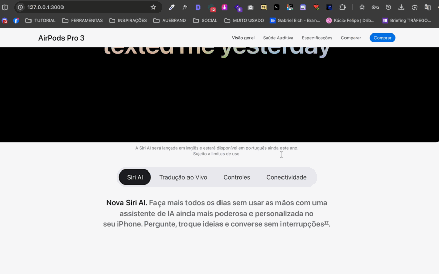
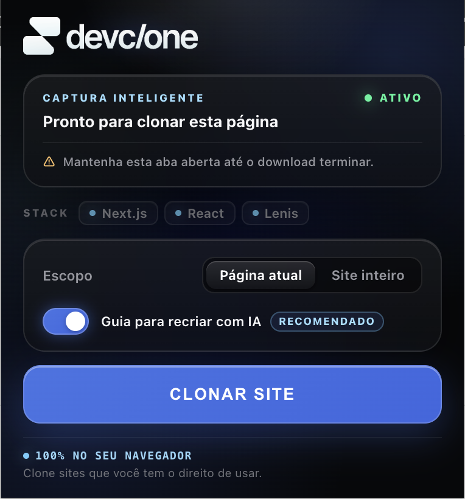

# DevClone

Chrome Extension + Agent Skill

DevClone is a local-first web extraction tool that enables developers to capture living web experiences directly in the browser and extract design systems into an interactive Visual Harness. Built for local processing without mandatory proprietary backends, telemetry, or account gating, DevClone accesses target web pages directly during capture and reconstructs dynamic experiences into standalone `.zip` bundles ready for local execution and AI-assisted reverse engineering.



<p align="center">
  <a href="https://github.com/Auebrand/DEVCLONE-EXTENSION">⭐ Star on GitHub</a> &nbsp;•&nbsp;
  <a href="docs/media/devclone-demo.gif">▶️ View Demo</a>
</p>

---

## The Chrome Extension



The **DevClone Chrome Extension** runs as a native Manifest V3 tool in your browser. Unlike traditional page savers that only preserve initial static HTML, DevClone records network requests and living DOM nodes during execution to produce high-fidelity offline clones:

- **Deep Runtime Capture via CDP:** Uses Chrome DevTools Protocol (`chrome.debugger`) to record exact network responses, capturing protected scripts, WebAssembly, fonts, videos, and dynamic runtime assets that would otherwise return HTTP 403 on isolated downloads.
- **Client-Side Stack Detection:** Inspects DOM structures and runtime globals to identify frameworks and libraries (Next.js, React, Vue, Nuxt, Tailwind CSS, GSAP, Three.js, Swiper, Lenis, Framer, and more).
- **ES Module & CSS Asset Resolution:** Traverses and rewrites module dependency graphs (`import`/`export` specifiers, `@import`, and `url(...)` declarations) to relative local paths.
- **Chunked Native ZIP Packaging:** Packages assets in-memory using the browser's native `CompressionStream('deflate-raw')` and transfers chunks through an offscreen document to avoid memory limits.
- **Zero-Config Local Preview:** Injects cross-platform local servers (`ABRIR-SITE.command` for macOS, `ABRIR-SITE.cmd` for Windows, and `servidor-local.js` for Node.js) into every clone, eliminating `file://` security policy issues.

---

## Two modes

DevClone supports two distinct workflows tailored for developers and AI reverse-engineering tasks:

### 01 — Full Clone
Captures and reconstructs the complete web experience locally for inspection, archival, or refactoring:
- **Preserved Assets:** HTML, CSS, JavaScript, responsive images, web fonts (WOFF2/WOFF/TTF), video/audio, WebAssembly binaries (`.wasm`), Rive animations (`.riv`), Lottie JSON, and 3D assets (`.glb`/`.gltf`).
- **Dynamic Runtime Handling:** Injects shims for local module loading, removes CSP and remote `<base>` tags, and generates diagnostic reports (`RELATORIO-DE-CAPTURA.txt`, `VALIDACAO-DE-ANIMACOES.txt`).
- **Structured IA Context:** Generates an optional `AI_CONTEXT.md` detailing the page's color palette, typography hierarchy, landmarks, headings, and observed layout patterns.

### 02 — Visual DNA / Harness
Focuses strictly on extracting the design system and interactive micro-behavior without cloning the website's full content or textual pages:
- **Design Tokens:** Real computed values extracted via browser inspection (`getComputedStyle`), including primary/secondary palettes, font families, modular type scales, container widths, spacing scales, border radii, and box shadows.
- **Real Button States:** Measures interactive button variants across default, `:hover`, and `:focus` states using programmatic viewport interaction.
- **Animation Extraction:** Parses captured CSS and JS to isolate active `@keyframes`, CSS transitions, and library controller logic (GSAP, Framer Motion, Lenis, Swiper).
- **Interactive Mini-App:** Compiles everything into `harness/index.html`—a standalone, navigable HTML/CSS/JS sandbox demonstrating the extracted tokens and animations live in the browser.

---

## Chrome Extension

The extension operates locally in your browser. It communicates directly with your active tab and debugger session without transmitting captured content to external proprietary servers.

### Install

1. Clone or download this repository:
   ```bash
   git clone https://github.com/Auebrand/DEVCLONE-EXTENSION.git
   ```
2. Open Google Chrome and navigate to `chrome://extensions/`.
3. Enable **Developer mode** in the top-right corner.
4. Click **Load unpacked** (*Carregar sem compactação*).
5. Select the `extension/` directory from this repository:
   ```text
   DEVCLONE/extension/
   ```
6. The DevClone icon will appear in your Chrome toolbar, ready for use on any HTTP/HTTPS webpage.

---

## Agent Skill

Beyond the Chrome Extension, DevClone is available as an autonomous **Agent Skill** for coding agents and terminal workflows. It runs headless via Node.js and Playwright, providing both Full Clone and Visual Harness extraction directly from the command line or within conversational AI environments.

### Claude Web / direct installation

- **Distribution Artifact:** `skill/devclone.skill`
- A pre-packaged, self-contained zip artifact designed for direct installation into Claude Web or compatible skill-based interfaces.
- Requires no manual Playwright configuration on the user's side when imported into containerized sandbox environments.

### Terminal / agent environments

For CLI agents, terminal environments, and IDEs (such as Claude Code, Cursor, Codex, and Antigravity), the full source code is available in:
```text
skill/source/
├── SKILL.md
├── claude-web/
│   └── devclone-SKILL.md
└── scripts/
    └── engine/
        ├── clone.mjs
        ├── package.json
        ├── lib/
        └── vendor/
```

- Powered by a headless Node.js engine (`clone.mjs`) orchestrating Chromium through Playwright.
- Executes two-pass network capture (desktop and mobile viewport emulation) implementing an equivalent resolution and rewriting pipeline to the Chrome Extension.

---

## Quick start

### Extension

1. Load `extension/` in Chrome via `chrome://extensions/`.
2. Navigate to any website.
3. Open the DevClone popup and click **CLONAR SITE**.

### Agent Skill (CLI / Headless)

From the project root:

```bash
# Navigate to the standalone engine
cd skill/source/scripts/engine

# Install dependencies
npm install
npx playwright install chromium

# Mode 1: Full Clone
node clone.mjs https://example.com --mode full

# Mode 2: Visual DNA & Harness
node clone.mjs https://example.com --mode harness
```

---

## Architecture

DevClone is architected around two complementary implementations sharing consistent extraction logic:

```text
DevClone
├── Chrome Extension (Manifest V3)
│   ├── Popup UI (Options & Stack Display)
│   ├── Background Service Worker
│   ├── CDP Bridge & Network Capture
│   ├── Content Script (DOM Inspection & URL Rewriting)
│   ├── Recursive Asset, CSS & ES Module Resolution
│   └── Native ZIP & Preview Package Generation
│
└── Agent Skill
    ├── SKILL.md (Agent Instructions)
    ├── devclone.skill (Claude Web Portable Artifact)
    └── Node.js + Playwright Standalone Engine
        ├── Mode 1: Full Clone (Offline bundle)
        └── Mode 2: Visual DNA / Harness (Design System)
```

---

## Repository Structure

```text
DEVCLONE/
├── extension/          # Chrome Extension (Manifest V3 unpacked source)
├── skill/
│   ├── devclone.skill  # Portable artifact for Claude Web and AI skill environments
│   └── source/         # Standalone Node.js + Playwright engine and agent guides
├── docs/
│   └── media/          # Official visual documentation assets (demo GIF & preview PNG)
├── README.md           # Project documentation and architecture guide
└── .gitignore          # Repository ignore rules
```

- `extension/`: Pure client-side browser extension source code, icons, manifest, and background worker.
- `skill/`: Includes the portable `.skill` package and the decoupled Node.js CLI engine with modular libraries.
- `docs/media/`: Visual demonstrations and interface captures embedded in this documentation.

---

## Development

### Extension

The Chrome extension uses native JavaScript without a compilation or bundling step.

- **Load in Browser:** Navigate to `chrome://extensions/`, enable Developer Mode, and click *Load unpacked* selecting `extension/`.
- **Syntax Check:**
  ```bash
  node --check extension/*.js
  ```

### Skill Engine

The standalone engine requires Node.js (>= 18.17) and Playwright.

- **Setup:**
  ```bash
  cd skill/source/scripts/engine
  npm install
  npx playwright install chromium
  ```
- **Syntax Check:**
  ```bash
  node --check clone.mjs lib/*.mjs vendor/*.js
  ```
- **CLI Options:**
  ```bash
  node clone.mjs --help
  ```

---

## Security & Privacy

DevClone is designed around local execution principles:

- **Local Processing:** All DOM parsing, style computation, asset rewriting, and ZIP generation happen directly on your machine.
- **Direct Target Requests:** Network traffic during capture occurs exclusively between your environment and the target website being analyzed.
- **No Proprietary Telemetry:** There are no analytics, cloud backends, licensing verification servers, or account gates built into the project.
- **Sensitive Endpoint Filtering:** Network capture rules in `capture.js` actively filter out typical authentication, account, session, and checkout endpoints (`/auth`, `/checkout`, `/account`, `/sessions`) to prevent saving sensitive session responses.
- **DOM Password Manager Filters:** Content inspection scripts ignore nodes injected by password managers (e.g., 1Password, LastPass).
- **Codebase Secrets Audit:** Automated static analysis confirmed zero hardcoded API keys, tokens, or private credentials within this repository.

---

## License

DevClone is distributed under a **Source-Available License**.

**Free to use. Not free to resell.**

- **Permitted:** Free for personal, educational, and internal business use. Code inspection, learning, and custom modifications for your own use are fully permitted.
- **Restrictions:** Commercial redistribution, reselling, sublicensing, packaging into competing commercial products, or distributing commercial derivatives is strictly prohibited without prior written authorization from the copyright holder.
- **Trademarks:** This license does not grant rights to the "DevClone" name, logotype, symbols, or official brand assets.
- **Commercial Rights:** The copyright holder retains the exclusive right to commercialize DevClone, provide official commercial versions, and offer paid support or integration services.

See the full terms in the [LICENSE](LICENSE) file.

---

## GitHub

Explore the repository, report issues, and star the project on GitHub:

👉 [https://github.com/Auebrand/DEVCLONE-EXTENSION](https://github.com/Auebrand/DEVCLONE-EXTENSION)
